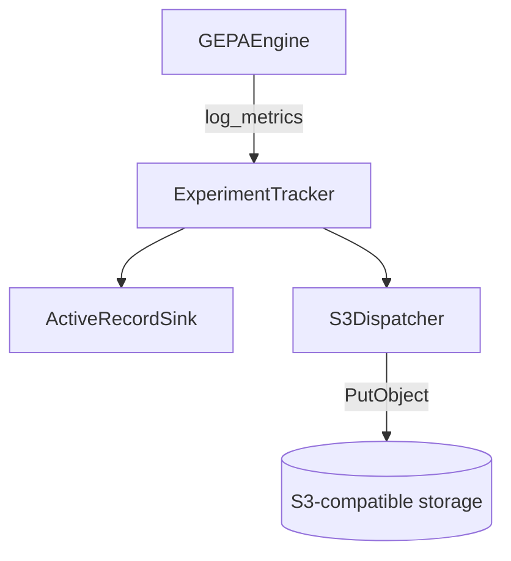
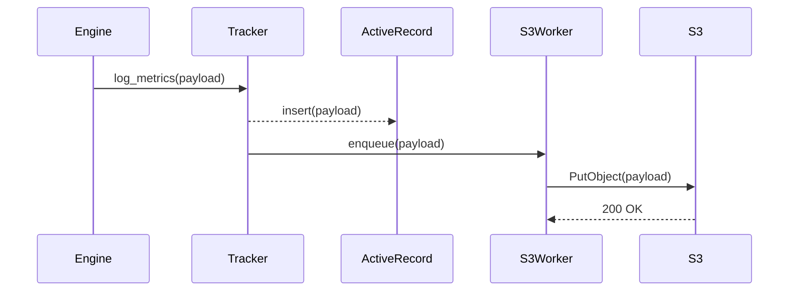

# ADR 009: GEPA Telemetry Phase 0 Plan

## Status
Accepted

## Context
- Issue: [#107](https://github.com/vicentereig/dspy.rb/issues/107)
- Goal: Port the Python GEPA optimizer to Ruby with full observability parity.
- Reference materials:
  - Sequence diagrams outlined in the GitHub issue (GEPA optimize → Engine → Proposer flow).
  - Existing Ruby instrumentation for `DSPy::Teleprompt::MIPROv2`.
  - Python OpenTelemetry hooks in `../gepa` and `../dspy`.

The GEPA optimization flow introduces several long-running phases with nested loops:

1. `GEPA.optimize` bootstraps state, evaluates the seed candidate, and delegates to `GEPAEngine.run`.
2. `GEPAEngine` performs iterative reflective mutation:
   - Select a Pareto candidate.
   - Sample minibatches and evaluate the current program.
   - Assemble reflective datasets from traces.
   - Ask the reflection LM for new instructions.
   - Evaluate / accept the new candidate and update Pareto fronts.

Each of these steps maps cleanly to observability spans in the existing Python implementation (via Langfuse / OpenTelemetry). To maintain parity, we need a dedicated telemetry layer before writing the full port so that subsequent phases can instrument logic as it lands.

## Decision
Add a reusable `GEPA::Telemetry` module that standardizes span names, attributes, and logging events for every stage of the sequence diagram. Phase 0 delivered:

1. **Telemetry primitives**
   - `GEPA::Telemetry.with_span(operation, metadata = {}, &block)` → wraps `DSPy::Context.with_span`, injects GEPA metadata, and mirrors Python span names (`gepa.optimize`, `gepa.engine.iteration`, etc.).
   - `GEPA::Telemetry.emit(event, metadata = {})` → thin wrapper over `DSPy.log` for structured logs when OTEL is disabled.
   - Default attributes include `optimizer: "GEPA"`, optional iteration counters, candidate IDs, and LM request hashes.

2. **Span naming map** derived from the sequence diagram:
   | Ruby span key | Python / diagram step |
   | ------------- | --------------------- |
   | `gepa.optimize` | API entry span |
   | `gepa.state.initialize` | seed candidate + baseline |
   | `gepa.engine.run` | outer optimization loop |
   | `gepa.engine.iteration` | per-iteration boundary |
   | `gepa.proposer.select_candidate` | Pareto selection |
   | `gepa.proposer.evaluate_subsample` | minibatch evaluation w/ traces |
   | `gepa.proposer.make_reflective_dataset` | dataset building |
   | `gepa.proposer.generate_candidate` | LM reflection round |
   | `gepa.engine.acceptance_test` | validation + Pareto update |

3. **Spec scaffolding**
  - `spec/unit/gepa/telemetry_spec.rb` ensures spans set expected attributes and preserve parent/child relationships when nesting.
  - Use `DSPy::Observability.enabled?` guard to validate behaviour both with and without OTEL.

4. **Developer documentation**
   - Documented in this ADR and referenced in issue #107.

## Consequences
- Later implementation phases can focus on business logic while calling `GEPA::Telemetry` helpers to emit spans.
- Ensures parity with Python observability before logic lands, reducing risk of missing instrumentation.
- Introducing telemetry first allows us to write tests that assert span names/attributes even if the optimizer logic is still a stub.
- Completed phases now include logging shims, experiment tracker, merge proposer, per-predictor trace capture, and `feedback_map`-driven reflective datasets plus smoke tests and documentation.

## Status by Phase

| Phase | Description | Status |
|-------|-------------|--------|
| 0 | Telemetry primitives & ADR | ✅ Complete |
| 1 | Core primitives & Pareto utils | ✅ Complete |
| 2 | Strategies (selectors, batch sampler, instruction proposer) | ✅ Complete |
| 3 | Reflective mutation proposer | ✅ Complete |
| 4 | Engine & API | ✅ Complete |
| 5 | DSPy teleprompter integration | ✅ Complete |
| 6 | Logging & experiment tracker shims (Ruby) | ✅ Complete |
| 7 | Parity hardening & documentation | ✅ Complete |

## Next Steps

- Monitor the in-memory tracker and `feedback_map` usage; future work could add the S3-compatible backend outlined in docs.
- Consider porting additional Python conveniences (custom instruction proposers, richer failure handling) once we need them.

---

## Legacy Documentation: GEPA Optimizer (Beta)

> Genetic-Pareto Reflective Prompt Evolution for DSPy.rb

GEPA evolves a module's instructions by replaying traces, collecting feedback, and asking a reflection
model to propose improvements. The Ruby port currently supports:

- Core GEPA engine (state, Pareto frontier, reflective proposer).
- DSPy teleprompter (`DSPy::Teleprompt::GEPA`) that works with any `DSPy::Module` built from a signature or composite module.
- Optional reflection LM via `DSPy::ReflectionLM` or any callable object (text only for now).
- Merge proposer (`GEPA::Proposer::MergeProposer`) for recombining high-scoring descendants.

```ruby
gepa = DSPy::Teleprompt::GEPA.new(
  metric: ->(example, prediction) { prediction[:answer] == example.expected_values[:answer] ? 1.0 : 0.0 },
  reflection_lm: DSPy::ReflectionLM.new('openai/gpt-4o-mini', api_key: ENV['OPENAI_API_KEY'])
)

result = gepa.compile(student_module, trainset: train_examples, valset: validation_examples)
```

**Reflection LM requirements**
- Plain-text responses (structured outputs disabled).
- Returns the updated instruction inside ``` fences (handled automatically by `InstructionProposalSignature`).
- Pass a callable (e.g. `reflection_lm.method(:call).to_proc`) when using custom stubs so Sorbet accepts the type.
- Prompts now include per-predictor traces, so reflection models see the component name and its diff instead of a single shared transcript.

### Predictor-level feedback

- Pass `feedback_map` when constructing the teleprompter to supply per-component feedback hooks (optional—omit it to fall back to whatever your metric returns):

```ruby
feedback_map = {
  'alpha' => lambda do |predictor_output:, predictor_inputs:, module_inputs:, module_outputs:, captured_trace:|
    DSPy::Prediction.new(
      score: predictor_output[:answer] == module_inputs.expected_values[:answer] ? 1.0 : 0.0,
      feedback: "alpha needs to mention #{module_inputs.expected_values[:answer]}"
    )
  end
}

gepa = DSPy::Teleprompt::GEPA.new(metric: metric, feedback_map: feedback_map)
```

- Each proc receives the component's output, its inputs, the full module example/prediction, and the captured trace so you can craft domain-specific guidance without rewriting the global metric.

### Testing

- `spec/integration/dspy/teleprompt/gepa_smoke_spec.rb` exercises the full reflective optimization loop with telemetry, experiment tracking, and a deterministic reflection LM.
- Snapshot expectations live in `spec/fixtures/gepa/smoke_snapshot.yml`, giving the integration spec a cassette-like regression target.
- Regenerate the snapshot with `bundle exec ruby -I lib examples/gepa_snapshot.rb` whenever fixture drift is intentional.
- For a full workflow, see `examples/ade_optimizer_gepa/`, which optimizes the ADE classifier using GEPA and `feedback_map` hooks.
- Budget reminder: your `max_metric_calls` must at least cover the validation set size. The sample ADE script defaults to 600 and will auto-increase if the budget is too small.

### Experiment tracking

- `GEPA::Logging::ExperimentTracker` allows you to add subscribers that persist metrics. For example, wiring an ActiveRecord model:

```ruby
tracker = GEPA::Logging::ExperimentTracker.new

tracker.with_subscriber do |event|
  GepaExperiment.create!(
    run_id: event[:metrics][:run_id],
    step: event[:step],
    payload: event[:metrics]
  )
end

teleprompter = DSPy::Teleprompt::GEPA.new(metric: metric)
result = teleprompter.compile(program, trainset:, valset:)
```

### S3-compatible logging design

#### Requirements
- Persist experiment logs to an S3-compatible bucket (MinIO, Cloudflare R2, AWS) without blocking the optimization loop.
- Offer a pluggable local sink (ActiveRecord or JSONL) for quick inspection while offline.
- Guarantee append-only writes and idempotent uploads so retries do not duplicate events.
- Defer network interaction to a background worker while keeping the tracker API synchronous.





### Parity roadmap

- Richer dataset adapters (multi-predictor, ReAct trace capture). Current Ruby adapter mirrors all named predictors but shares the same batch feedback across them until per-predictor traces land.
- Optional logging backends (e.g., Langfuse, WandB) layered on top of the experiment tracker subscribers.
- Parity checks against the Python GEPA test suite.
