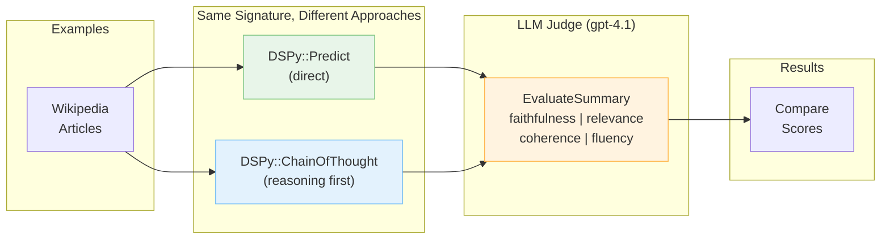

You're pairing with a coworker. They claim Chain Of Thought always produces better output. 
You're skeptical. For simple tasks like summarization, does _think step by step_ really help? 
Instead of running on blind assumptions, you two decide to run an experiment.

With [DSPy.rb](https://github.com/vicentereig/dspy.rb), this takes about 50 lines of code.

## Setting Things up

We need three things:
1. A **summarization task** to compare
2. An **LLM judge** to score quality
3. An **evaluation harness** to run them both

Let's build each piece.



### One Task, Two Approaches

A signature defines the task. Nothing fancy: just text in, summary out:

```ruby
class Summarize < DSPy::Signature
  description "Summarize the given text concisely while preserving key concepts"

  input do
    const :text, String, description: "Text to summarize"
  end

  output do
    const :summary, String, description: "Concise summary preserving key concepts (2-3 sentences)"
  end
end
```

Now we can create two predictors from the same signature:

```ruby
DSPy.configure do |config|
  config.lm = DSPy::LM.new('openai/gpt-4o-mini', api_key: ENV['OPENAI_API_KEY'])
end

prediction = DSPy::Predict.new(Summarize)
puts prediction.summary

cot_prediction = DSPy::ChainOfThought.new(Summarize)
puts cot_prediction.summary
puts cot_prediction.reasoning
```

### Multi-Dimensional Quality Scoring

Here's where it gets interesting. Instead of manually reviewing summaries, we use another LLM to evaluate them. 
This G-Eval style approach scores multiple dimensions:

```ruby
class EvaluateSummary < DSPy::Signature
  description <<~DESC.strip
    Evaluate summary quality using G-Eval criteria.
    Be critical and objective. Most summaries should score 3-4, not 5.
  DESC

  input do
    const :source_text, String, description: "Original text"
    const :summary, String, description: "Summary to evaluate"
  end

  output do
    const :faithfulness, Integer,
      description: "Score 1-5: Is the summary factually accurate?"
    const :relevance, Integer,
      description: "Score 1-5: Does it capture the most important information?"
    const :coherence, Integer,
      description: "Score 1-5: Is it well-structured with logical flow?"
    const :fluency, Integer,
      description: "Score 1-5: Is it grammatically correct and readable?"
    const :overall_score, Float,
      description: "Overall quality score from 1.0 to 5.0"
  end
end
```

The `description` fields guide the judge on what each score means. We use `DSPy::ChainOfThought` for the judge so it reasons through its evaluation.

### Packaging the Judge for Evaluation

A metric is a lambda that takes an example and prediction, returning evaluation results:

```ruby
def create_llm_judge_metric(judge_lm)
  judge = DSPy::ChainOfThought.new(EvaluateSummary)
  judge.configure { |c| c.lm = DSPy::LM.new('openai/gpt-4.1', api_key: ENV['OPENAI_API_KEY']) }

  ->(example, prediction) do
    eval_result = judge.call(
      source_text: example.input_values[:text],
      summary: prediction.summary
    )

    {
      passed: eval_result.overall_score >= 3.5,
      score: eval_result.overall_score / 5.0,  # Normalize to 0-1
      faithfulness: eval_result.faithfulness,
      relevance: eval_result.relevance,
      coherence: eval_result.coherence,
      fluency: eval_result.fluency
    }
  end
end
```

### Running Both Side by Side

`DSPy::Evals` unifies predictors, examples, and metrics. The API is dead simple:

```ruby
examples = wikipedia_articles.map do |doc|
  DSPy::Example.new(
    signature_class: Summarize,
    input: { text: doc[:text] },
    expected: { summary: "" }  # LLM judge evaluates absolute quality
  )
end

llm_judge_metric = create_llm_judge_metric(judge_lm)

predict_evaluator = DSPy::Evals.new(predict, metric: llm_judge_metric)
predict_result = predict_evaluator.evaluate(examples)

cot_evaluator = DSPy::Evals.new(cot, metric: llm_judge_metric)
cot_result = cot_evaluator.evaluate(examples)
```

## The Results

We ran both predictors on 5 Wikipedia articles (Photosynthesis, Byzantine Empire, Machine Learning, Great Barrier Reef, French Revolution) 
using `gpt-4o-mini` as the summarizer and `gpt-4.1` as the judge.

```
Predict avg score:        93.0%
ChainOfThought avg score: 96.0%
Improvement:              +3.0 percentage points
```

The per-dimension breakdown tells a richer story:

| Dimension    | Predict | CoT   | Δ    |
|--------------|---------|-------|------|
| Faithfulness | 4.4/5   | 4.8/5 | +0.4 |
| Relevance    | 4.4/5   | 4.4/5 | +0.0 |
| Coherence    | 4.8/5   | 5.0/5 | +0.2 |
| Fluency      | 5.0/5   | 5.0/5 | +0.0 |

ChainOfThought's edge comes from **faithfulness** and **coherence**. The reasoning step seems to help the model avoid hallucinations and produce better-structured output. Relevance and fluency? Both approaches nail it.

## 3 Points Better—Worth It?

For summarization with a capable model like `gpt-4o-mini`, ChainOfThought provides a modest but real improvement—particularly in factual accuracy. The 3 percentage point gain might matter for production use cases where faithfulness is critical.

But here's the thing: you don't have to guess anymore. The experiment took under an hour to build. The pattern works for any comparison:

- Predict vs ChainOfThought
- Different models (Claude vs GPT)
- Different prompt strategies
- Temperature variations

## Run It Yourself

The complete example is in the repo:

```bash
export OPENAI_API_KEY=your-key
bundle exec ruby examples/summarization_comparison.rb
```

Tweak `DSPY_SUMMARIZER_MODEL` and `DSPY_JUDGE_MODEL` environment variables to experiment with different model combinations.

## Takeaways

1. **Signatures define the task** — same signature, different predictors
2. **LLM judges scale evaluation** — multi-dimensional scoring without manual review
3. **DSPy::Evals unifies the workflow** — predictors, examples, and metrics in one API
4. **Data beats blind assumptions** — 50 lines of code settles the ChainOfThought question

Next time a coworker claims one approach is "obviously better," suggest an experiment. With DSPy.rb, you'll have results before the coffee gets cold.
