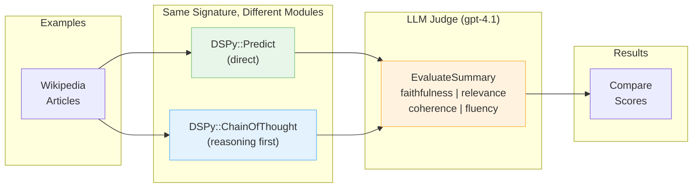

You're pairing with a coworker. They claim Chain Of Thought always produces better output.

You're skeptical. For a short summarization task, does an extra reasoning step help enough to justify another model behavior? We ran the comparison instead of settling it by taste.

The experiment uses one signature, two [DSPy.rb](https://github.com/vicentereig/dspy.rb) modules, five Wikipedia excerpts, and the same LLM judge for every output.


```mermaid
flowchart LR
    subgraph Examples
        E1["Wikipedia<br/>Articles"]
    end

    subgraph Predictors["Same Signature, Different Modules"]
        P["DSPy::Predict<br/>(direct)"]
        C["DSPy::ChainOfThought<br/>(reasoning first)"]
    end

    subgraph Judge["LLM Judge (gpt-4.1)"]
        J["EvaluateSummary<br/>faithfulness | relevance<br/>coherence | fluency"]
    end

    subgraph Results
        R["Compare<br/>Scores"]
    end

    E1 --> P --> J
    E1 --> C --> J
    J --> R

    style P fill:#e8f5e9,stroke:#81c784
    style C fill:#e3f2fd,stroke:#64b5f6
    style J fill:#fff3e0,stroke:#ffb74d
```

## One Task, Two Modules

The signature keeps the task fixed while the module changes how DSPy executes it.

```ruby
class Summarize < DSPy::Signature
  description "Summarize the given text concisely while preserving key concepts"

  input do
    const :text, String, description: "Text to summarize"
  end

  output do
    const :summary, String,
      description: "Concise summary preserving key concepts (2-3 sentences)"
  end
end

DSPy.configure do |config|
  config.lm = DSPy::LM.new(
    "openai/gpt-4o-mini",
    api_key: ENV["OPENAI_API_KEY"]
  )
end

direct = DSPy::Predict.new(Summarize)
reasoned = DSPy::ChainOfThought.new(Summarize)

direct_result = direct.call(text: source_text)
reasoned_result = reasoned.call(text: source_text)
```

This is a module comparison, not a prompt-string comparison. DSPy constructs the provider requests from the same signature; `ChainOfThought` adds its reasoning strategy.

## Define Acceptable Summary Behavior

There is no reference summary in this experiment. Another model scores each output for faithfulness, relevance, coherence, and fluency. The types make the judge's inputs and outputs explicit:

```ruby
class EvaluatorMindset < T::Enum
  enums do
    Critical = new("critical")
    Balanced = new("balanced")
    Generous = new("generous")
  end
end

class GroundedSummary < T::Struct
  const :source_text, String
  const :summary, String
end

class EvaluateSummary < DSPy::Signature
  description "Evaluate summary quality using G-Eval criteria according to the specified mindset."

  input do
    const :grounded_summary, GroundedSummary
    const :mindset, EvaluatorMindset
  end

  output do
    const :faithfulness, Integer,
      description: "Score 1-5: Is the summary factually accurate?"
    const :relevance, Integer,
      description: "Score 1-5: Does it capture the most important information?"
    const :coherence, Integer,
      description: "Score 1-5: Is it well-structured with logical flow?"
    const :fluency, Integer,
      description: "Score 1-5: Is it grammatically correct and readable?"
    const :overall_score, Float,
      description: "Overall quality score from 1.0 to 5.0"
  end
end
```

The judge turns our definition of acceptable behavior into a metric result. It returns both a threshold decision and a normalized score:

```ruby
def create_llm_judge_metric(judge_lm, mindset: EvaluatorMindset::Critical)
  judge = DSPy::ChainOfThought.new(EvaluateSummary)
  judge.configure { |config| config.lm = judge_lm }

  lambda do |example, prediction|
    evaluation = judge.call(
      grounded_summary: GroundedSummary.new(
        source_text: example.input_values[:text],
        summary: prediction.summary
      ),
      mindset: mindset
    )

    {
      passed: evaluation.overall_score >= 3.5,
      score: evaluation.overall_score / 5.0,
      faithfulness: evaluation.faithfulness,
      relevance: evaluation.relevance,
      coherence: evaluation.coherence,
      fluency: evaluation.fluency
    }
  rescue StandardError => e
    { passed: false, score: 0.0, error: e.message }
  end
end
```

The `3.5` threshold and the judge's rubric are part of the experiment. They are not objective properties of summarization. A deployment decision would need judge calibration against human ratings and repeated runs to measure variance.

## Run Both Programs Against The Same Evidence

```ruby
examples = wikipedia_articles.map do |document|
  DSPy::Example.new(
    signature_class: Summarize,
    input: { text: document[:text] },
    expected: { summary: "" }
  )
end

judge_lm = DSPy::LM.new(
  "openai/gpt-4.1",
  api_key: ENV["OPENAI_API_KEY"]
)
metric = create_llm_judge_metric(judge_lm)

direct_result = DSPy::Evals.new(
  DSPy::Predict.new(Summarize),
  metric: metric
).evaluate(examples)

reasoned_result = DSPy::Evals.new(
  DSPy::ChainOfThought.new(Summarize),
  metric: metric
).evaluate(examples)
```

The placeholder expected summary is unused by this metric. It is present because `DSPy::Example` records the task's expected output shape.

## What This Run Found

We ran both modules on five Wikipedia articles: Photosynthesis, Byzantine Empire, Machine Learning, Great Barrier Reef, and the French Revolution. `gpt-4o-mini` generated the summaries; `gpt-4.1` judged them.

```text
Predict avg score:        93.0%
ChainOfThought avg score: 96.0%
Improvement:              +3.0 percentage points
```

| Dimension | Predict | ChainOfThought | Difference |
|---|---:|---:|---:|
| Faithfulness | 4.4/5 | 4.8/5 | +0.4 |
| Relevance | 4.4/5 | 4.4/5 | 0.0 |
| Coherence | 4.8/5 | 5.0/5 | +0.2 |
| Fluency | 5.0/5 | 5.0/5 | 0.0 |

In this run, ChainOfThought scored three percentage points higher, with the difference concentrated in faithfulness and coherence. Five documents and one judge run are not enough to establish a general advantage. The result is evidence for a follow-up experiment, not proof that ChainOfThought improves summaries.

The next useful run would add more documents, repeat judge calls, inspect disagreements manually, and record latency and token cost. A three-point score difference may disappear under that variance or cost more than it is worth.

## Run It Yourself

```bash
export OPENAI_API_KEY=your-key
bundle exec ruby examples/summarization_comparison.rb
```

Use `DSPY_SUMMARIZER_MODEL` and `DSPY_JUDGE_MODEL` to compare other model combinations. Keep the examples and judge fixed when comparing modules, then change one experimental variable at a time.
