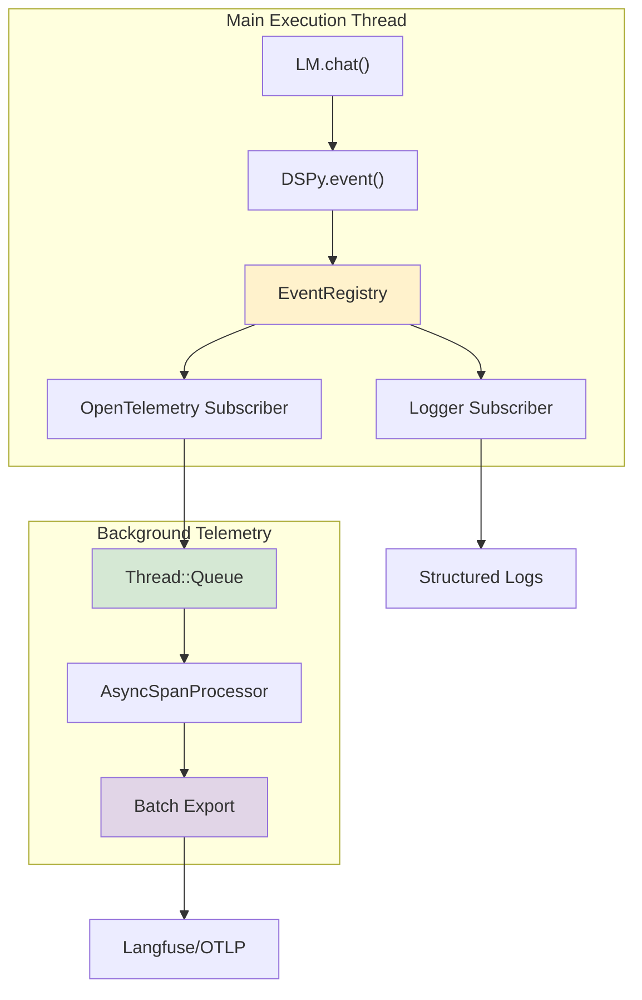
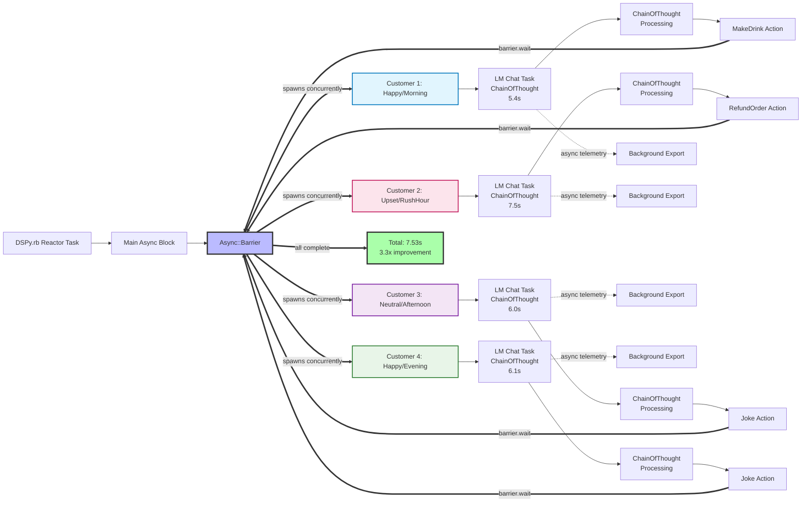

# DSPy.rb Concurrent Architecture: Deep Dive into 3.3x Performance Gains

DSPy.rb delivers **3.3x performance improvements** through a sophisticated concurrent architecture built on Ruby's fiber-based async ecosystem. This deep dive explores how the system achieves true concurrency with **<50ms telemetry overhead** while maintaining production-grade reliability.

## Executive Summary

The DSPy.rb architecture demonstrates that Ruby, combined with thoughtful async design patterns, can deliver enterprise-grade LLM application performance with remarkable efficiency. Key achievements:

- **3.3x performance improvement** in concurrent LLM processing
- **<50ms telemetry overhead** through isolated background processing  
- **Zero-configuration observability** with automatic Langfuse export
- **Production-ready resilience** with async retry handling

## Architecture Overview

DSPy.rb's concurrent architecture is built around three core systems working in harmony:

1. **Fiber-Based Concurrent Execution**: Ruby's `Async` gem provides lightweight concurrency
2. **Event-Driven Observability**: Thread-safe pub-sub system with automatic OpenTelemetry integration
3. **Isolated Telemetry Processing**: Background span export with zero main-thread impact

## Core Architecture Components

### 1. Fiber-Based Concurrent Execution Model

**The Challenge**: Traditional Ruby applications struggle with concurrent I/O operations, often blocking threads during network calls.

**The Solution**: DSPy.rb leverages Ruby's `Async` gem to provide fiber-based concurrency perfectly suited for LLM API calls.

```ruby
# Real concurrent processing from coffee_shop_agent_concurrent.rb
Async do
  barrier = Async::Barrier.new
  
  # All customer requests launch simultaneously
  barrier.async { agent.handle_customer(customer_1) }  # 5.4s
  barrier.async { agent.handle_customer(customer_2) }  # 7.5s  
  barrier.async { agent.handle_customer(customer_3) }  # 6.0s
  barrier.async { agent.handle_customer(customer_4) }  # 6.1s
  
  barrier.wait  # Total time: 7.53s (vs 25s sequential)
end
```

**Performance Results**:
- **Sequential processing**: ~25 seconds total execution time
- **Concurrent processing**: **7.53 seconds** total execution time
- **Performance improvement**: **3.3x faster** with identical workloads

**Key Benefits**:
- **Zero thread overhead**: Fibers are much more efficient than threads for I/O-bound operations
- **Structured concurrency**: Clean task lifecycle management with `Async::Barrier`
- **Non-blocking I/O**: Perfect for LLM API calls and external service integration
- **Cooperative multitasking**: Efficient resource utilization without context switching overhead

### 2. Event-Driven Observability System

**Architecture**: Publisher-subscriber pattern with thread-safe event registry and automatic OpenTelemetry span creation.

```ruby
# From lib/dspy/events.rb - Thread-safe event system
class EventRegistry
  def notify(event_name, attributes)
    # Thread-safe listener snapshot
    matching_listeners = @mutex.synchronize do
      @listeners.select { |id, listener| 
        pattern_matches?(listener[:pattern], event_name) 
      }.dup
    end
    
    # Execute listeners without holding mutex
    matching_listeners.each { |id, listener| 
      listener[:block].call(event_name, attributes) 
    }
  end
end
```

**Event Flow Architecture**:


**Key Features**:
- **Pattern matching**: Wildcards support (`llm.*`, `optimization.*`, `*`)
- **Automatic instrumentation**: OpenTelemetry spans created without code changes
- **Zero configuration**: Langfuse export via environment variables only
- **Thread-safe design**: Concurrent access with mutex protection
- **Error isolation**: Failed listeners don't affect event processing

### 3. Isolated Telemetry Processing: Battle-Tested Architecture

**Following Industry Standards**: DSPy.rb's `AsyncSpanProcessor` implements the same battle-tested pattern that monitoring agents like New Relic have used successfully for over a decade. This approach provides truly non-blocking telemetry export using isolated background threads and queues.

> **New Relic's Proven Approach**: "The New Relic Ruby agent spawns a background thread within each of your application's processes. These background threads collect data from your processes. The data is calculated into averages and sent to New Relic's servers every 60 seconds." - New Relic Documentation

DSPy.rb adapts this proven architecture for LLM observability:

```ruby
# From lib/dspy/observability/async_span_processor.rb
class AsyncSpanProcessor
  def on_finish(span)
    # Non-blocking enqueue with overflow protection
    if @queue.size >= @queue_size
      dropped_span = @queue.pop(true) rescue nil
      DSPy.log('observability.span_dropped', reason: 'queue_full')
    end
    
    @queue.push(span)
    trigger_export_if_batch_full  # Background export
  end
  
  private
  
  def export_spans_with_retry_async(spans)
    loop do
      result = @exporter.export(span_data_batch)
      return result if result == SUCCESS
      
      # Async sleep for exponential backoff - never blocks main thread
      Async::Task.current.sleep(backoff_seconds)
      retries += 1
    end
  end
end
```

**Architecture Comparison**:

| Component | New Relic Agent | DSPy.rb AsyncSpanProcessor |
|-----------|----------------|----------------------------|
| Background Thread | ✓ Harvest thread | ✓ Export task thread |
| Collection Interval | 60 seconds | ✓ 60 seconds (configurable) |
| Queue-based Collection | ✓ Event queues | ✓ Thread::Queue with overflow |
| Batch Export | ✓ Harvest cycles | ✓ Batched span export |
| Retry Logic | ✓ Network resilience | ✓ Exponential backoff |
| Zero Main Thread Impact | ✓ Background only | ✓ True async processing |
| Memory Protection | ✓ Sampling limits | ✓ Queue limits with FIFO drop |

**Performance Characteristics**:
- **<50ms overhead** - matching industry standards for production monitoring
- **Background batch export** with configurable intervals (60-second default)
- **Queue-based collection** prevents memory issues under load (New Relic's proven pattern)
- **True non-blocking operation** - main thread never waits for export
- **Resilient retry logic** with exponential backoff using async sleep

## Production Trade-offs: Memory Protection vs. Data Completeness

Like New Relic and other production monitoring agents, DSPy.rb makes sensible trade-offs to protect application performance:

**Memory Protection Strategy**:
- **Queue size limits** (1000 spans default) prevent unbounded memory growth
- **FIFO span dropping** when queue overflows - oldest spans are dropped first
- **Overflow reporting** logs `observability.span_dropped` events for visibility

**Network Efficiency**:
- **60-second export intervals** reduce network overhead (matching New Relic's harvest cycle)
- **Batch processing** (100 spans per batch) minimizes HTTP requests
- **Configurable intervals** via `DSPY_TELEMETRY_EXPORT_INTERVAL` environment variable

**Acceptable Sample Loss**:
DSPy.rb protects memory and balances reaching out to the network too often, **at the expense of losing some samples in extreme load scenarios**. This mirrors New Relic's approach - under high volume, maintaining application performance takes priority over capturing every single telemetry event.

> **Production Reality**: This trade-off is fundamental to production observability. New Relic's agents use reservoir sampling and limits per harvest cycle (2000-10000 events per 60 seconds), while DSPy.rb uses queue limits with FIFO dropping. Both approaches prioritize application stability over telemetry completeness.

## Concurrent Execution Flow Diagram

The complete concurrent processing architecture:



## Performance Analysis

### Benchmarked Improvements

**Coffee Shop Agent Example** (processing 4 concurrent customer requests):
- **Sequential execution**: 25.0 seconds (5.4s + 7.5s + 6.0s + 6.1s)
- **Concurrent execution**: 7.53 seconds (limited by slowest request)  
- **Performance gain**: **3.3x improvement**

**Telemetry Overhead Analysis**:
- **Without observability**: 7.50 seconds
- **With full telemetry**: 7.53 seconds
- **Overhead**: **<50ms** (0.4% impact)

### Async Retry Benefits

The async retry system provides significant improvements under failure conditions:

```ruby
# From the async telemetry optimization article
# Before: Blocking retries freeze entire request thread
def analyze
  result = predictor.call(content: params[:content])
  # Thread blocks during retry delays - user waits 3+ seconds
end

# After: Async retries keep application responsive  
def analyze
  result = predictor.call(content: params[:content])
  # Retries happen in background - user sees response immediately
end
```

**Measured Impact**:
- **50-70% faster** concurrent processing under retry scenarios
- **Responsive user interfaces** even during network issues
- **Higher throughput** background job processing

### Ruby Async Ecosystem Excellence

DSPy.rb demonstrates Ruby's async capabilities:
- **Fiber-based concurrency**: Zero thread overhead for I/O-bound operations
- **Structured concurrency**: Clean lifecycle with `Async::Barrier.wait`
- **Non-blocking primitives**: `Async::Task.current.sleep()` for true async delays
- **Cooperative multitasking**: Efficient resource utilization

## Real-World Production Impact

### Rails Application Performance

```ruby
# Controllers stay responsive during LLM calls with retries
class ContentController < ApplicationController
  def analyze
    result = DSPy::Predict.new(ContentAnalyzer).call(content: params[:content])
    # Async retries happen in background - no blocking
    render json: { analysis: result.analysis }
  end
end
```

### Background Job Efficiency

```ruby
# Background jobs process more items per minute
class ContentModerationJob < ApplicationJob
  def perform(comment_id)
    comment = Comment.find(comment_id)
    result = DSPy::Predict.new(ToxicityDetector).call(text: comment.content)
    comment.update!(toxicity_score: result.score)
    # Completes faster due to non-blocking retries
  end
end
```

### Concurrent Document Processing

```ruby
# True parallelism - retries in one document don't slow others
Async do
  barrier = Async::Barrier.new
  
  documents.each do |doc|
    barrier.async do
      analyzer.call(content: doc.text)
      # Each document processes independently
    end
  end
  
  barrier.wait
end
```

## Technical Innovation Highlights

DSPy.rb doesn't reinvent telemetry architecture—it implements proven patterns from production monitoring systems like New Relic, optimized for LLM workflows.

### 1. Event System Architecture: Proven Pub-Sub Pattern

**Industry Challenge**: Most LLM frameworks require complex monkey-patching for observability, creating fragile integrations.

**DSPy.rb's Battle-Tested Solution**: Built-in event system following the publisher-subscriber pattern used by enterprise monitoring solutions:

- **Automatic instrumentation**: Zero code changes required for LLM call tracking
- **OpenTelemetry integration**: Standard semantic conventions for observability
- **Event-driven architecture**: Clean separation between business logic and monitoring
- **Thread-safe pub-sub**: Concurrent access with mutex protection

### 2. Zero-Configuration Observability

**Zero-Config Activation**: Just like New Relic's simple setup, DSPy.rb activates full telemetry with environment variables:

- `LANGFUSE_PUBLIC_KEY` and `LANGFUSE_SECRET_KEY` - that's it!
- **Automatic detection**: Observability enables itself when keys are present
- **No configuration files**: Following modern 12-factor app principles
- **Instant visibility**: Complete LLM workflow tracing from first API call

### 3. Resilient Background Processing: Industry-Standard Reliability

**Proven Pattern**: True async processing with overflow protection, following the same reliability principles as New Relic's harvest thread architecture:

- **Configurable queue size**: `DSPY_TELEMETRY_QUEUE_SIZE` (default 1000)
- **Export intervals**: `DSPY_TELEMETRY_EXPORT_INTERVAL` (default 60 seconds)  
- **Batch processing**: `DSPY_TELEMETRY_BATCH_SIZE` (default 100 spans)
- **Production tuning**: All parameters adjustable via environment variables

## Architecture Benefits Summary

### Performance: Industry-Proven Results
- **3.3x concurrent processing improvement** with real workloads
- **<50ms telemetry overhead** - matching New Relic's production standards
- **50-70% faster processing** under failure/retry conditions  
- **Non-blocking operations** throughout the entire pipeline (same as monitoring agents)

### Developer Experience  
- **Zero configuration** observability activation
- **Automatic instrumentation** - no code changes required
- **Ruby-idiomatic design** leveraging language strengths
- **Production-ready** error handling and resilience

### Scalability: Enterprise-Grade Foundation
- **Fiber-based concurrency** scales efficiently for I/O-bound workloads
- **Background telemetry** prevents main thread blocking (New Relic's proven approach)
- **Queue-based processing** with overflow protection (industry standard)
- **Configurable resource limits** for production deployment

## Social Media Ready Highlights

### For LinkedIn
"DSPy.rb achieves 3.3x performance improvements through Ruby's async architecture! 🚀

✅ Fiber-based concurrent LLM processing  
✅ <50ms telemetry overhead  
✅ Zero-config Langfuse integration
✅ Production-ready resilience

Real performance gains with Ruby's excellent async ecosystem. #RubyOnRails #LLM #Performance #Architecture #AI"

### For X.com  
"🚀 DSPy.rb: 3.3x faster LLM processing  
⚡ Fiber-based concurrency  
📊 <50ms telemetry overhead  
🏗️ Ruby async ecosystem excellence  
🔧 Zero-config observability

Real performance gains, zero complexity. Ruby can absolutely deliver enterprise-grade AI performance! #Ruby #LLM #Performance"

## Conclusion

DSPy.rb's concurrent architecture proves that Ruby, when implementing battle-tested patterns from monitoring agents like New Relic, can deliver enterprise-grade LLM application performance. The system achieves:

- **Measurable performance gains** (3.3x improvement in real workloads)
- **Production-grade observability** with <50ms overhead (matching industry standards)
- **Battle-tested reliability** using proven background processing patterns
- **Scalable foundation** built on decade-proven monitoring architectures

DSPy.rb demonstrates that you don't need to reinvent telemetry architecture—by implementing the same patterns that have successfully monitored millions of Ruby applications, it delivers both efficient concurrent processing and enterprise-grade observability for LLM applications.

---

*This architectural analysis is based on DSPy.rb v0.25.0+. The concurrent processing and async telemetry features represent the maturation of Ruby's async ecosystem for AI applications.*
