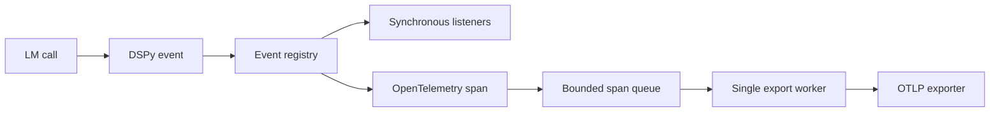

An earlier version of this article attributed a 3.3x batch speedup to DSPy.rb's concurrent architecture. The repository no longer contains the benchmark that produced that number, and the architecture has several boundaries that the claim collapsed into one.

Applications schedule concurrent tasks. DSPy.rb keeps model and tracing context separate across fibers. The optional observability integration exports completed spans on a dedicated worker. Whether provider requests overlap still depends on the surrounding tasks and the provider transport.

> Install the optional `dspy-o11y` and `dspy-o11y-langfuse` gems (or set `DSPY_WITH_O11Y=1 DSPY_WITH_O11Y_LANGFUSE=1` inside this repo) to enable the observability stack described here.

## Application-owned concurrency

Use sibling Async tasks when several module calls can run independently:

```ruby
require 'async'
require 'async/barrier'

Async do
  agent = CoffeeShopAgent.new
  barrier = Async::Barrier.new

  barrier.async { agent.handle_customer(customer_1) }
  barrier.async { agent.handle_customer(customer_2) }
  barrier.async { agent.handle_customer(customer_3) }
  barrier.async { agent.handle_customer(customer_4) }

  barrier.wait
end
```

`Async::Barrier` owns the child tasks and waits for the batch. The application identifies independent calls and creates those tasks; Ruby code determines the program's control flow.

Each LM call enters a `Sync` block so DSPy.rb has an Async task context and can fork its tracing context before calling the adapter. That wrapper is an execution boundary, not a concurrency policy. Calls overlap only when the surrounding application schedules sibling tasks and the selected provider transport yields cooperatively.

The older version of this article reported a 25-second sequential run and a 7.53-second concurrent run. The current repository has no runnable benchmark artifact for that coffee shop workload. The numbers therefore cannot support a current 3.3x performance claim. Benchmark the adapter and deployment path you use.

## Fiber-local execution context

DSPy.rb stores temporary LM selection and tracing state in fiber-local storage. `DSPy.with_lm` changes the model for the current fiber and restores the previous value in an `ensure` block. Modules resolve their model in this order:

1. An LM configured on the module instance.
2. The current fiber's `DSPy.with_lm` override.
3. The global `DSPy.config.lm`.

When `LM#chat` crosses into its `Sync` block, DSPy.rb forks the current context. That preserves trace and module ancestry without sharing mutable stacks between fibers.

This is isolation for DSPy state. It says nothing about thread safety inside a provider SDK or an object your application shares between tasks.

## Events are synchronous

DSPy's event registry takes a listener snapshot under a mutex, then invokes matching listeners outside the lock. Pattern subscriptions such as `llm.*` and `optimization.*` work across the registry.

```ruby
class EventRegistry
  def notify(event_name, attributes)
    matching_listeners = @mutex.synchronize do
      @listeners.select do |_id, listener|
        pattern_matches?(listener[:pattern], event_name)
      end.dup
    end

    matching_listeners.each do |_id, listener|
      listener[:block].call(event_name, attributes)
    end
  end
end
```

Listener callbacks run on the notifying thread. A slow custom subscriber can therefore delay the module call that emitted the event. The asynchronous boundary described below applies to OpenTelemetry span export, not to every event listener.


```mermaid
flowchart LR
    LM["LM call"] --> Event["DSPy event"]
    Event --> Registry["Event registry"]
    Registry --> Listener["Synchronous listeners"]
    Registry --> Span["OpenTelemetry span"]
    Span --> Queue["Bounded span queue"]
    Queue --> Worker["Single export worker"]
    Worker --> OTLP["OTLP exporter"]
```

## Span export leaves the request path

`DSPy::Observability::AsyncSpanProcessor` enqueues sampled, completed spans in a `Thread::Queue`. A `Concurrent::SingleThreadExecutor` drains that queue and calls the exporter. A timer thread schedules periodic drains; reaching the batch size schedules one immediately.

The defaults in current code are:

| Setting | Default |
|---|---:|
| Queue size | 1,000 spans |
| Export interval | 60 seconds |
| Export batch size | 100 spans |
| Shutdown timeout | 10 seconds |
| Export retries | 3 |

When the queue is full, `on_finish` removes the oldest span and records `observability.span_dropped`. Export retries use exponential backoff on the export worker. The producer does not wait for routine exports, but `force_flush` and `shutdown` do wait up to their configured timeout.

```ruby
def on_finish(span)
  return unless span.context.trace_flags.sampled?

  if @queue.size >= @queue_size
    @queue.pop(true)
    DSPy.log('observability.span_dropped', reason: 'queue_full')
  end

  @queue.push(span)
  trigger_export_if_batch_full
end
```

The queue bounds memory by accepting possible telemetry loss. Delivery remains best-effort, and a process that exits without a successful flush can lose queued spans.

## Claims the architecture cannot support alone

The previous article claimed less than 50 milliseconds of telemetry overhead and compared the implementation with New Relic. No benchmark, environment description, raw samples, or reproducible script survives in the repository. Background export explains why exporter latency leaves the ordinary request path. A fixed overhead still requires measurement.

The same qualification applies to LLM concurrency. Fiber scheduling can reduce batch wall-clock time when network waits overlap. It cannot overcome a blocking transport, provider rate limits, connection-pool limits, or dependent program steps.

The practical split is plain:

- Your Ruby program decides which module calls may overlap.
- DSPy.rb preserves model and trace context across those calls.
- The provider adapter and SDK determine whether network I/O yields.
- The observability integration queues completed spans for background export.

Measure each boundary separately. Otherwise a concurrency benchmark can end up measuring the provider, the rate limiter, and telemetry configuration while attributing the result to the wrong layer.

---

*This article describes the current architecture. DSPy.rb v0.28.0 removed its former core retry strategy; provider SDKs and applications now own retry policy.*
