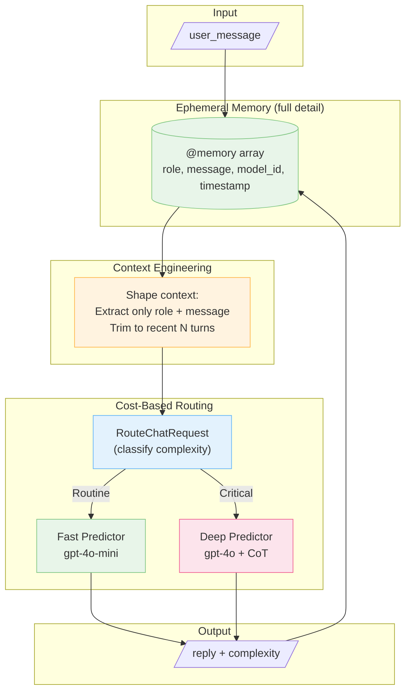

When teams ask for an "AI Agent" they usually need something simpler: a chat loop that remembers prior turns and occasionally routes complex requests to a smarter model. This article builds that system incrementally—starting from the simplest possible chat and layering memory, context engineering, and routing only when needed.

By the end, you'll understand how to control *what* the LLM sees (context engineering) separately from *what* you store (memory), and how to route requests to different models based on complexity.

## The End Goal

Here's what we're building: a chat agent that maintains conversation history, shapes context before sending it to the LLM, and routes messages to cheap or expensive models based on complexity.



But we won't start here. We'll build up to it.

## Step 1: The Simplest Chat (No Memory)

Everything in DSPy.rb starts with a Signature—a typed contract that defines inputs and outputs:

```ruby
class ResolveUserQuestion < DSPy::Signature
  description "Respond to a user question."

  input do
    const :user_message, String
  end

  output do
    const :reply, String
  end
end
```

To use it:

```ruby
predictor = DSPy::Predict.new(ResolveUserQuestion)
result = predictor.call(user_message: "What's the capital of France?")
puts result.reply  # => "The capital of France is Paris."
```

That's it. No prompt engineering, no JSON parsing—just define what goes in and what comes out.

## Step 2: Add Ephemeral Memory

A chat without memory forgets everything between turns. Let's fix that by accumulating history:

```ruby
class SimpleChat < DSPy::Module
  def initialize
    super()
    @memory = []
    @predictor = DSPy::Predict.new(ResolveUserQuestion)
  end

  def forward(user_message:)
    # Add user message to memory
    @memory << { role: 'user', message: user_message }

    # Call LLM with full history
    result = @predictor.call(
      user_message: user_message,
      history: @memory
    )

    # Add assistant reply to memory
    @memory << { role: 'assistant', message: result.reply }

    result
  end
end
```

But wait—the signature doesn't accept `history` yet. Let's update it:

```ruby
class ResolveUserQuestion < DSPy::Signature
  description "Respond to a user question given conversation history."

  class MemoryTurn < T::Struct
    const :role, String
    const :message, String
  end

  input do
    const :user_message, String
    const :history, T::Array[MemoryTurn], default: []
  end

  output do
    const :reply, String
  end
end
```

Now the LLM sees prior turns. But there's a problem brewing...

## Step 3: Context Engineering (The Two-Struct Pattern)

As conversations grow, you'll want to store more than just role and message—timestamps for debugging, model IDs for analytics, token counts for billing. But the LLM doesn't need any of that noise.

**Context engineering** means controlling what the LLM sees separately from what you store.

Here's the pattern: use a *rich* struct for storage, and a *lean* struct for the prompt.

```ruby
# Rich struct for storage/analytics
class ConversationMemoryEntry < T::Struct
  const :role, String
  const :message, String
  const :model_id, T.nilable(String)   # Which model answered?
  const :timestamp, String              # When did this happen?
  const :token_count, T.nilable(Integer) # How many tokens?
end

# Lean struct for the prompt (defined inside the signature)
class ResolveUserQuestion < DSPy::Signature
  class MemoryTurn < T::Struct
    const :role, String
    const :message, String
    # No timestamps, no model_id—just what the LLM needs
  end
end
```

Now shape context before sending:

```ruby
def forward(user_message:)
  # ... add user message to @memory ...

  # Shape context: extract only what the LLM needs
  memory_turns = @memory.map do |entry|
    ResolveUserQuestion::MemoryTurn.new(
      role: entry.role,
      message: entry.message
    )
  end

  # Optional: trim to recent N turns to stay within context limits
  memory_turns = memory_turns.last(10)

  result = @predictor.call(
    user_message: user_message,
    history: memory_turns
  )

  # Store rich entry with metadata
  @memory << ConversationMemoryEntry.new(
    role: 'assistant',
    message: result.reply,
    model_id: @predictor.lm&.model_id,
    timestamp: Time.now.utc.iso8601
  )

  result
end
```

**Before (what you store):**
```ruby
{ role: 'user', message: 'Hello', model_id: nil, timestamp: '2025-11-23T10:00:00Z' }
{ role: 'assistant', message: 'Hi!', model_id: 'gpt-4o-mini', timestamp: '2025-11-23T10:00:01Z' }
```

**After (what the LLM sees):**
```ruby
{ role: 'user', message: 'Hello' }
{ role: 'assistant', message: 'Hi!' }
```

Same data, different shapes for different purposes.

## Step 4: Cost-Based Routing

Not every message needs your most expensive model. "What time is it?" doesn't require GPT-4o. But "Help me plan a database migration strategy" probably does.

First, define a classifier signature:

```ruby
class ComplexityLevel < T::Enum
  enums do
    Routine = new('routine')
    Detailed = new('detailed')
    Critical = new('critical')
  end
end

class RouteChatRequest < DSPy::Signature
  description "Estimate message complexity to route to the appropriate model."

  input do
    const :message, String
    const :conversation_depth, Integer
  end

  output do
    const :level, ComplexityLevel
    const :confidence, Float
    const :reason, String
    const :suggested_cost_tier, String
  end
end
```

Then build a router that dispatches to different predictors:

```ruby
class ChatRouter < DSPy::Module
  def initialize(classifier:, routes:, default_level: ComplexityLevel::Routine)
    super()
    @classifier = classifier
    @routes = routes
    @default_level = default_level
  end

  def forward(message:, memory:)
    # Classify the message
    classification = @classifier.call(
      message: message,
      conversation_depth: memory.length
    )

    # Pick the right predictor
    level = classification.level
    predictor = @routes.fetch(level, @routes[@default_level])

    RouteDecision.new(
      predictor: predictor,
      model_id: predictor.lm&.model_id || 'unknown',
      level: level,
      reason: classification.reason,
      cost_tier: classification.suggested_cost_tier
    )
  end
end
```

Wire it up:

```ruby
classifier = DSPy::Predict.new(RouteChatRequest)

fast_predictor = DSPy::Predict.new(ResolveUserQuestion)
fast_predictor.configure { |c| c.lm = DSPy::LM.new('openai/gpt-4o-mini') }

deep_predictor = DSPy::ChainOfThought.new(ResolveUserQuestion)
deep_predictor.configure { |c| c.lm = DSPy::LM.new('openai/gpt-4o') }

router = ChatRouter.new(
  classifier: classifier,
  routes: {
    ComplexityLevel::Routine => fast_predictor,
    ComplexityLevel::Detailed => fast_predictor,
    ComplexityLevel::Critical => deep_predictor
  }
)
```

Notice: both predictors share the same `ResolveUserQuestion` signature. You can swap models and techniques without changing the contract.

## Step 5: Clean Separation with Lifecycle Callbacks

The full implementation uses DSPy's `around` callbacks to separate concerns. Just like Rails' `around_action`, this wraps `forward` so routing stays focused while callbacks handle memory:

```ruby
class EphemeralMemoryChat < DSPy::Module
  around :update_memory

  def initialize(signature:, router:)
    super()
    @signature = signature
    @router = router
    @memory = []
    @current_route = nil
  end

  def forward(user_message:)
    # Route to the right predictor
    @current_route = @router.call(message: user_message, memory: @memory)

    # Shape context (lean structs only)
    memory_turns = @memory.map do |entry|
      @signature::MemoryTurn.new(role: entry.role, message: entry.message)
    end

    # Call the selected predictor
    @current_route.predictor.call(
      user_message: user_message,
      history: memory_turns,
      selected_model: @current_route.model_id
    )
  end

  private

  def update_memory(_args, kwargs)
    message = kwargs[:user_message]

    # Before: record user message
    @memory << ConversationMemoryEntry.new(
      role: 'user',
      message: message,
      model_id: nil,
      timestamp: Time.now.utc.iso8601
    )

    result = yield  # Run forward()

    # After: record assistant reply
    @memory << ConversationMemoryEntry.new(
      role: 'assistant',
      message: result.reply,
      model_id: @current_route.model_id,
      timestamp: Time.now.utc.iso8601
    )

    result
  end
end
```

## Where to Extend

This skeleton supports many upgrades without rewriting the core loop:

- **Persistent memory** — Swap `@memory` array with ActiveRecord queries. Load in `initialize`, persist in `update_memory`.
- **Smarter context selection** — Use embeddings (`informers` gem) to pick the most relevant turns instead of just recent ones.
- **Tool use** — Replace a route's predictor with `DSPy::ReAct` for function calling.
- **Deep research** — Point the "critical" route to `DSPy::DeepResearch` for multi-step reasoning.

## Key Takeaways

1. **Start simple** — A chat is just a signature + predictor + array. Don't add complexity until you need it.

2. **Separate storage from prompts** — Use rich structs for memory, lean structs for context. This is the core of lightweight context engineering.

3. **Shape context explicitly** — Control what the LLM sees. Trim history, remove noise, select relevant turns.

4. **Route by complexity** — Use cheap models for simple questions, expensive models for hard ones. Same signature, different backends.

5. **Use callbacks for lifecycle** — `around` keeps memory concerns out of your routing logic.

## Try It

The full implementation is in [`examples/ephemeral_memory_chat.rb`](https://github.com/vicentereig/dspy.rb/blob/main/examples/ephemeral_memory_chat.rb):

```bash
OPENAI_API_KEY=sk-your-key bundle exec ruby examples/ephemeral_memory_chat.rb
```
