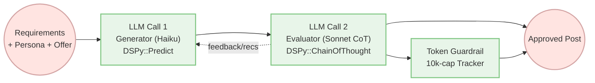

Outbound copy rarely ships on the first LLM pass. DSPy.rb keeps the loop—propose, critique, refine—without burning budget.

## 1. Why Evaluator Loops?
Evaluator–optimizer is a two-model handshake: generator drafts, evaluator grades and prescribes fixes, loop repeats until the rubric is met. Anthropic says it shines when “LLM responses can be demonstrably improved when a human articulates their feedback.”[^1]



## 2. Signatures as Functions
[Our running example](https://github.com/vicentereig/dspy.rb/blob/main/examples/evaluator_loop.rb) turns LLMs into callable functions:

```ruby
class GenerateLinkedInArticle < DSPy::Signature
  input  { const :topic_seed, TopicSeed; const :vibe_toggles, VibeToggles; const :structure_template, StructureTemplate; const :recommendations, T::Array[Recommendation], default: [] }
  output { const :post, String; const :hooks, T::Array[String] }
end

class EvaluateLinkedInArticle < DSPy::Signature
  input  { const :post, String; const :topic_seed, TopicSeed; const :vibe_toggles, VibeToggles; const :recommendations, T::Array[Recommendation]; const :hooks, T::Array[String]; const :attempt, Integer }
  output { const :decision, EvaluationDecision; const :recommendations, T::Array[Recommendation]; const :self_score, Float }
end
```

## 3. Loop Mechanics: draft → critique within a guardrail
`SalesPitchWriterLoop` pairs a lightweight Anthropic Haiku generator with an Anthropic Sonnet evaluator (Chain-of-Thought). Budget, not iterations, is the guardrail—unlike [DSPy::ReAct](https://vicentereig.github.io/dspy.rb/blog/articles/react-agent-tutorial/) loops that cap turns. Evaluator probes: “Did we quantify pain cost?” “Is the CTA a single action?” Returned fixes: “Add a % proof metric,” “Retune tone to consultative.”

## 4. O11y at a Glance
Latest Langfuse trace (Nov 21, 2025 — Haiku draft, Sonnet CoT evaluator):

```
└─ SalesPitchWriterLoop.forward (ed89899bac229240)
   └─ SalesPitchWriterLoop.forward (ee155baa7ea3c707)
      └─ SalesPitchWriterLoop.forward (25d6c7cb5ce67556)
         ├─ DSPy::Predict.forward (886c35a6382591b6)
         │  └─ llm.generate (a19c643a7a7ebad2)
         └─ DSPy::ChainOfThought.forward (a4ae3f51d105e27e)
            ├─ DSPy::Predict.forward (2c09e511ef4112e3)
            │  └─ llm.generate (1693f7a4893de528)
            ├─ chain_of_thought.reasoning_complete (2f6cf25f6e671e4e)
            └─ chain_of_thought.reasoning_metrics (7bb07c8d57d3041b)
```

Outcome: 1 attempt; 5,926 / 10,000 tokens; Langfuse cost ≈ $0.0258.

## 5. Run It
`rbenv exec bundle exec ruby examples/evaluator_loop.rb` (needs `ANTHROPIC_API_KEY` in `.env`). Tune budget with `DSPY_SLOP_TOKEN_BUDGET`; swap models via `DSPY_SLOP_GENERATOR_MODEL` and `DSPY_SLOP_EVALUATOR_MODEL`.

[^1]: Anthropic, “Building effective agents,” Workflow: Evaluator-optimizer, Dec 19 2024. https://www.anthropic.com/engineering/building-effective-agents#workflow-evaluator-optimizer
