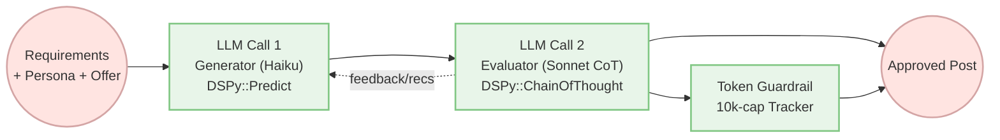

Outbound copy rarely ships on the first LLM pass. You write a prompt, get something decent, tweak it, try again... and burn tokens guessing what "good enough" means. [DSPy.rb](https://github.com/vicentereig/dspy.rb) turns this into a structured loop—propose, critique, refine—with a clear stopping condition.

## Why Evaluator Loops?

The evaluator-optimizer pattern is a two-model handshake: a generator drafts content, an evaluator grades it against criteria and prescribes fixes, and the loop repeats until the rubric is met or the budget runs out. Anthropic recommends this pattern when "LLM responses can be demonstrably improved when a human articulates their feedback."[^1]

The key insight: use a cheap, fast model for drafting and a smarter model for critique. You get quality feedback without paying premium prices for every token.



## Signatures as Functions

DSPy Signatures turn LLM calls into typed, callable functions. [Our running example](https://github.com/vicentereig/dspy.rb/blob/main/examples/evaluator_loop.rb) defines two signatures—one for generating drafts, one for evaluating them:

```ruby
class GenerateLinkedInArticle < DSPy::Signature
  description "Draft a concise sales pitch that embraces a persona's preferences."

  input do
    const :topic_seed, TopicSeed
    const :vibe_toggles, VibeToggles
    const :structure_template, StructureTemplate
    const :recommendations, T::Array[Recommendation], default: []
  end

  output do
    const :post, String
    const :hooks, T::Array[String]
  end
end

class EditorMindset < T::Enum
  enums do
    Skeptical = new('skeptical')   # Rarely approves, pushes for excellence
    Balanced = new('balanced')     # Fair assessment across quality levels
    Lenient = new('lenient')       # More likely to approve decent work
  end
end

class EvaluateLinkedInArticle < DSPy::Signature
  description "Evaluate a sales pitch draft according to the specified editor mindset."

  input do
    const :post, String
    const :topic_seed, TopicSeed
    const :vibe_toggles, VibeToggles
    const :recommendations, T::Array[Recommendation]
    const :hooks, T::Array[String]
    const :attempt, Integer
    const :mindset, EditorMindset
  end

  output do
    const :decision, EvaluationDecision,
      description: "Default to 'needs_revision' unless the post meets all criteria."
    const :recommendations, T::Array[Recommendation]
    const :self_score, Float
  end
end
```

Notice the `EditorMindset` enum—it controls how critically the evaluator scores drafts. The `decision` output description guides the LLM to default to rejection. More on tuning mindset below.

## Loop Mechanics: draft → critique within a guardrail

`SalesPitchWriterLoop` pairs a cheap Haiku generator with a smarter Sonnet evaluator (using Chain-of-Thought for reasoning). The loop continues until either the evaluator approves or the token budget runs out—unlike [DSPy::ReAct](https://vicentereig.github.io/dspy.rb/blog/articles/react-agent-tutorial/) which caps iterations.

```ruby
class SalesPitchWriterLoop < DSPy::Module
  subscribe 'lm.tokens', :count_tokens  # Track token usage

  def forward(**input_values)
    tracker = TokenBudgetTracker.new(limit: @token_budget_limit)
    recommendations = []

    while tracker.remaining.positive?
      # Cheap model drafts
      draft = generator.call(**input_values.merge(recommendations: recommendations))

      # Smart model critiques with configured mindset
      eval = evaluator.call(
        post: draft.post,
        hooks: draft.hooks,
        mindset: @mindset,
        **input_values
      )

      # Feed recommendations back into next iteration
      recommendations = eval.recommendations || []
      break if eval.decision == EvaluationDecision::Approved
    end
  end

  private

  def generator
    @generator ||= DSPy::Predict.new(GenerateLinkedInArticle)
  end

  def evaluator
    @evaluator ||= DSPy::ChainOfThought.new(EvaluateLinkedInArticle)
  end

  def count_tokens(_event_name, attributes)
    return unless @active_budget_tracker

    @active_budget_tracker.track(
      prompt_tokens: attributes[:input_tokens],
      completion_tokens: attributes[:output_tokens]
    )
  end
end
```

The evaluator asks questions like: "Did we quantify the pain cost?" "Is the CTA a single action?" Then returns actionable fixes: "Add a percentage proof metric," "Retune tone to consultative."

## Tuning the Evaluator Mindset

Here's the catch: LLM evaluators tend to be sycophantic. They'll approve mediocre content because they default to "yes." If your loop finishes in one iteration every time, your evaluator is probably too easy to please.

The fix is type-safe—use a `T::Enum` to constrain the evaluator's mindset:

```ruby
class EditorMindset < T::Enum
  enums do
    Skeptical = new('skeptical')   # Rarely approves, pushes for excellence
    Balanced = new('balanced')     # Fair assessment across quality levels
    Lenient = new('lenient')       # More likely to approve decent work
  end
end

# Pass the mindset when constructing the loop
loop = SalesPitchWriterLoop.new(
  generator: generator,
  evaluator: evaluator,
  token_budget_limit: 10_000,
  mindset: EditorMindset::Skeptical  # Or ::Balanced, ::Lenient
)
```

The enum becomes a constrained input to the evaluator—the LLM receives it as a structured choice rather than freeform text. Combined with the output description (`"Default to 'needs_revision' unless the post meets all criteria."`), this makes the evaluator earn its approval.

Other levers you can pull:
- **Self-score threshold**: The example requires `self_score >= 0.9` even if decision is "approved"
- **Forced criticisms**: Require the output to include at least N specific issues
- **Rubric criteria**: Add explicit pass/fail fields for each quality dimension

## O11y at a Glance
[DSPy.rb](https://github.com/vicentereig/dspy.rb) ships observability out of the box: every `lm.tokens` event flows into Langfuse, so you don’t need X‑ray vision to see whether budget burned on the draft or the critique. Peek at the latest trace (Nov 21, 2025 — Haiku draft, Sonnet CoT evaluator):

```
└─ SalesPitchWriterLoop.forward (ed89899bac229240)
   └─ SalesPitchWriterLoop.forward (ee155baa7ea3c707)
      └─ SalesPitchWriterLoop.forward (25d6c7cb5ce67556)
         ├─ DSPy::Predict.forward (886c35a6382591b6)
         │  └─ llm.generate (a19c643a7a7ebad2)
         └─ DSPy::ChainOfThought.forward (a4ae3f51d105e27e)
            ├─ DSPy::Predict.forward (2c09e511ef4112e3)
            │  └─ llm.generate (1693f7a4893de528)
            ├─ chain_of_thought.reasoning_complete (2f6cf25f6e671e4e)
            └─ chain_of_thought.reasoning_metrics (7bb07c8d57d3041b)
```

Outcome: 1 attempt; 5,926 / 10,000 tokens; Langfuse cost ≈ $0.0258. Generator and evaluator hops are labeled, so you can confirm the cheap model carried drafting while the expensive model handled critique. Prefer shell? [`lf-cli`](https://github.com/vicentereig/lf-cli) points at the same Langfuse project and gives you the tree from your coding terminal.

## Run It

```bash
bundle exec ruby examples/evaluator_loop.rb
```

Requires `ANTHROPIC_API_KEY` in your `.env`. You can tune:
- `DSPY_SLOP_TOKEN_BUDGET` — how many tokens before the loop gives up
- `DSPY_SLOP_GENERATOR_MODEL` — the cheap drafting model
- `DSPY_SLOP_EVALUATOR_MODEL` — the smart critique model

## Takeaways

Evaluator loops beat single-shot prompts when quality matters. The pattern is simple:
1. **Signatures as functions** — typed inputs and outputs, no prompt wrangling
2. **Cheap draft, smart critique** — Haiku generates, Sonnet evaluates
3. **Budget as guardrail** — token cap instead of iteration cap
4. **Skeptical by design** — use `T::Enum` to constrain evaluator mindset and output descriptions to set defaults

The `EditorMindset` enum is your main lever for controlling evaluator behavior. Don't settle for sycophantic feedback—make the loop earn its approval.

[^1]: Anthropic, “Building effective agents,” Workflow: Evaluator-optimizer, Dec 19 2024. https://www.anthropic.com/engineering/building-effective-agents#workflow-evaluator-optimizer
