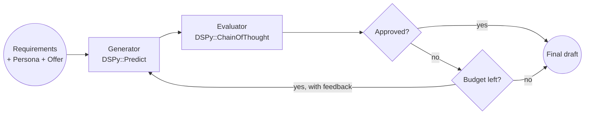

Outbound copy rarely ships on the first LLM pass. A generator can draft it and an evaluator can return specific revisions, but Ruby should decide when the process stops.

[DSPy.rb](https://github.com/vicentereig/dspy.rb) makes that generator-evaluator pattern a deterministic workflow: propose, critique, revise, and stop when the evaluator approves or the token budget runs out. The models produce typed results. They do not choose the control flow.

## The workflow

The generator-evaluator pattern uses two model calls with different jobs. A generator drafts the post. An evaluator grades the draft against a rubric and returns revisions. The application feeds those revisions into the next attempt.[^1]


```mermaid
flowchart LR
    In((Requirements\n+ Persona + Offer))
    Gen["Generator\nDSPy::Predict"]
    Eval["Evaluator\nDSPy::ChainOfThought"]
    Decision{"Approved?"}
    Budget{"Budget left?"}
    Out((Final draft))

    In --> Gen --> Eval --> Decision
    Decision -->|yes| Out
    Decision -->|no| Budget
    Budget -->|yes, with feedback| Gen
    Budget -->|no| Out
```

This is a workflow, not an agent loop. The `while` statement, approval rule, and token limit are application code. Neither model can add a step, select a tool, or change the stopping condition.

## Define the two calls

[The running example](https://github.com/vicentereig/dspy.rb/blob/main/examples/evaluator_loop.rb) uses one signature for drafts and another for evaluations:

```ruby
class GenerateLinkedInArticle < DSPy::Signature
  description "Draft a concise sales pitch that embraces a persona's preferences."

  input do
    const :topic_seed, TopicSeed
    const :vibe_toggles, VibeToggles
    const :structure_template, StructureTemplate
    const :recommendations, T::Array[Recommendation], default: []
  end

  output do
    const :post, String
    const :hooks, T::Array[String]
  end
end

class EvaluateLinkedInArticle < DSPy::Signature
  description "Evaluate a sales pitch draft according to the specified editor mindset."

  input do
    const :post, String
    const :topic_seed, TopicSeed
    const :vibe_toggles, VibeToggles
    const :recommendations, T::Array[Recommendation]
    const :hooks, T::Array[String]
    const :attempt, Integer
    const :mindset, EditorMindset
  end

  output do
    const :decision, EvaluationDecision,
      description: "Default to 'needs_revision' unless the post meets all criteria."
    const :recommendations, T::Array[Recommendation]
    const :self_score, Float
  end
end
```

The signatures replace hand-maintained prompt templates with task descriptions, typed fields, and bounded outputs. The adapter still constructs provider prompts from that information.

## Keep control in Ruby

`SalesPitchWriterLoop` composes a cheaper generator with a stronger evaluator. The loop owns the budget and approval rule:

```ruby
class SalesPitchWriterLoop < DSPy::Module
  subscribe 'lm.tokens', :count_tokens,
    scope: DSPy::Module::SubcriptionScope::Descendants

  def forward(**input_values)
    tracker = TokenBudgetTracker.new(limit: @token_budget_limit)
    recommendations = []
    attempt = 0
    hashtag_band = input_values.fetch(:hashtag_band, HashtagBand.new)
    length_cap = input_values.fetch(:length_cap, LengthCap.new)

    while tracker.remaining.positive?
      attempt += 1
      draft = @generator.call(
        **input_values.merge(
          hashtag_band: hashtag_band,
          length_cap: length_cap,
          recommendations: recommendations
        )
      )

      evaluation = @evaluator.call(
        post: draft.post,
        hooks: draft.hooks,
        topic_seed: input_values[:topic_seed],
        vibe_toggles: input_values[:vibe_toggles],
        structure_template: input_values[:structure_template],
        hashtag_band: hashtag_band,
        length_cap: length_cap,
        recommendations: recommendations,
        attempt: attempt,
        mindset: @mindset,
      )

      recommendations = evaluation.recommendations || []
      break if evaluation.decision == EvaluationDecision::Approved &&
        evaluation.self_score >= SELF_SCORE_THRESHOLD
    end
  end
end
```

The complete example records every revision and returns a typed `RevisedDraft`. It also clears the active budget tracker in an `ensure` block. The abbreviated version above keeps the branch visible; use the linked example for the full implementation.

## Make approval harder to fake

LLM evaluators can approve weak drafts. The example exposes the evaluator's stance as a typed input:

```ruby
class EditorMindset < T::Enum
  enums do
    Skeptical = new('skeptical')
    Balanced = new('balanced')
    Lenient = new('lenient')
  end
end
```

The enum constrains the value passed to the evaluator. It does not guarantee a skeptical judgment. The output description, score threshold, and rubric fields still determine what the evaluator must report. A useful evaluator should return concrete defects that the next generator call can act on.

Other controls include:

- Require a minimum `self_score` before accepting `Approved`.
- Ask for a fixed number of specific criticisms.
- Represent each rubric item as a typed pass/fail field.
- Evaluate the loop against saved examples instead of judging one trace by eye.

## Inspect the whole run

The example subscribes to descendant `lm.tokens` events, so the token budget includes both generator and evaluator calls. With the optional Langfuse integration configured, module and LM spans show which model handled each stage.

One recorded run on November 21, 2025 used one attempt, 5,926 of 10,000 tokens, and about $0.0258. That is a measurement from one trace, not a general cost estimate. [`lf-cli`](https://github.com/vicentereig/lf-cli) can inspect the same Langfuse trace from a terminal.

## Run it

```bash
bundle exec ruby examples/evaluator_loop.rb
```

Set `ANTHROPIC_API_KEY` in `.env`. The example also accepts:

- `DSPY_SLOP_TOKEN_BUDGET` for the total token limit.
- `DSPY_SLOP_GENERATOR_MODEL` for the drafting model.
- `DSPY_SLOP_EVALUATOR_MODEL` for the critique model.

Use this pattern when the evaluation criteria can be stated and revisions can improve the next attempt. If the model must choose among tools or decide which operation to perform next, use an agent module such as `DSPy::ReAct` instead. The difference is who owns the branch.

[^1]: Anthropic, [“Building effective agents,” Workflow: Evaluator-optimizer](https://www.anthropic.com/engineering/building-effective-agents#workflow-evaluator-optimizer), December 19, 2024.
