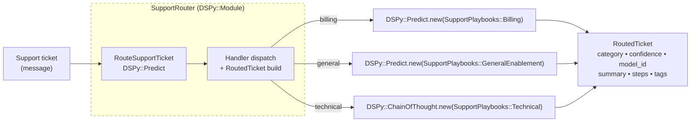

Successful LLM implementations rely on simple, composable patterns instead of sprawling frameworks. 
[DSPy.rb](https://github.com/vicentereig/dspy.rb) lets you compose that workflow with typed signatures so every prompt 
is generated programmatically instead of hand-written. 

This simple classifier-plus-specialists layout becomes essential once a single catch-all prompt starts to creak—complex requests need different context, follow-up  instructions, or even different models.
For the impatient, jump straight to the sample script in [`examples/workflow_router.rb`](https://github.com/vicentereig/dspy.rb/blob/main/examples/workflow_router.rb).



Rather than letting one mega prompt struggle to cover every
edge case, [DSPy.rb](https://github.com/vicentereig/dspy.rb) lets you compose a lightweight classifier plus a handful
of specialized predictors that stay focused and easy to optimize.

## Why a workflow before you build an agent?

Workflows keep LLMs and tools on predefined code paths—you still need to tune prompts, choose models, and explicitly wire every branch—so you retain deterministic control while you validate the solution.

## Architecture at a glance

Breaking down the router into components, we can delegate their predictions to specific models based on cost or performance. 

| Component                     | Prompting Technique                                                                 | Default Model                          | Purpose |
|-------------------------------|--------------------------------------------------------------------------------------|----------------------------------------|---------|
| RouteSupportTicket classifier | [`DSPy::Predict`](https://vicentereig.github.io/dspy.rb/core-concepts/predictors/)           | `anthropic/claude-haiku-4-5-20251001`  | Categorize each ticket + explain reasoning |
| Billing / General playbooks   | [`DSPy::Predict`](https://vicentereig.github.io/dspy.rb/core-concepts/predictors/#dspypredict) | `anthropic/claude-haiku-4-5-20251001`  | Cheap follow-up guidance for routine issues |
| Technical playbook            | [`DSPy::ChainOfThought`](https://vicentereig.github.io/dspy.rb/core-concepts/predictors/#dspychainofthought) | `anthropic/claude-sonnet-4-5-20250929` | Deeper reasoning + escalation steps for tricky tickets |
| SupportRouter                 | [`DSPy::Module`](https://vicentereig.github.io/dspy.rb/core-concepts/modules/)      | `anthropic/claude-haiku-4-5-20251001`  | Orchestrates classifier, handlers, and output struct |


1. **A signature to anchor ticket classification** – one `DSPy::Predict` call decides which category is the best fit and reports confidence/reasoning:
   ```ruby
   class RouteSupportTicket < DSPy::Signature
     input  { const :message, String }
     output do
       const :category, TicketCategory
       const :confidence, Float
       const :reason, String
     end
   end

   classifier = DSPy::Predict.new(RouteSupportTicket)
   classification = classifier.call(message: 'hello hello')
```
2. **Specialized playbooks** – each downstream signature tweaks the description/goal while reusing the shared schema. They are independent and they are predicted by different prompting techniques as need.
   ```ruby
   class SupportPlaybooks::Billing < DSPy::Signature
     include SharedSchema
     description "Resolve billing or refund issues with policy-aware guidance."
   end

   class SupportPlaybooks::Technical < DSPy::Signature
     include SharedSchema
     description "Handle technical or outage reports with diagnostic steps."
   end

   class SupportPlaybooks::GeneralEnablement < DSPy::Signature
     include SharedSchema
     description "Answer broad questions or point folks to self-serve docs."
   end
   ```  
   Instead of writing prompts, you adjust the signature description and let DSPy compile the right instructions for each specialized LLM call.
3. **Router module** – plain Ruby orchestrator that wires classifier + handlers, ensures every branch returns the same struct, and records the exact model that ran.
## Touring the Router Wrokflow

The full walkthrough lives in [`examples/workflow_router.rb`](https://github.com/vicentereig/dspy.rb/blob/main/examples/workflow_router.rb). Notice that every interaction goes through a `DSPy::Signature`, so we never drop into raw prompt strings—inputs/outputs are typed once and automatically compiled into prompts behind the scenes. Key pieces:

1. **Typed categories solve mystery intents**  
   ```ruby
   class TicketCategory < T::Enum
     enums do
       General = new('general')
       Billing = new('billing')
       Technical = new('technical')
     end
   end
   ```  
   When the classifier returns a `TicketCategory`, the router can’t receive unexpected strings like `"refund?"` or `"tech_support"`; all branches are exhaustively checked at compile time.

2. **Shared playbook schema keeps outputs uniform**  
   ```ruby
   module SupportPlaybooks
     module SharedSchema
       def self.included(base)
         base.class_eval do
           input  { const :message, String }
           output do
             const :resolution_summary, String
             const :recommended_steps, T::Array[String]
             const :tags, T::Array[String]
           end
         end
       end
     end
   end
   ```  
   Every follow-up predictor returns the same fields, so downstream logging/analytics doesn’t need per-branch adapters.

3. **Per-stage specialized models keep costs and performance predictable**  
   ```ruby
   billing_follow_up = DSPy::Predict.new(SupportPlaybooks::Billing)
   billing_follow_up.configure do |config|
     config.lm = DSPy::LM.new(LIGHTWEIGHT_MODEL, api_key: ENV['ANTHROPIC_API_KEY'])
   end

   technical_follow_up = DSPy::ChainOfThought.new(SupportPlaybooks::Technical)
   technical_follow_up.configure do |config|
     config.lm = DSPy::LM.new(HEAVY_MODEL, api_key: ENV['ANTHROPIC_API_KEY'])
   end
   ```  
   Each handler pins its own LM (`LIGHTWEIGHT_MODEL` vs `HEAVY_MODEL`), so moving billing/general flows to a cheaper Haiku snapshot or moving technical flows to Sonnet is just an env tweak, not a code change.

4. **SupportRouter centralizes dispatch + telemetry context**  
   ```ruby
   class SupportRouter < DSPy::Module
     def forward_untyped(**input_values)
       classification = @classifier.call(**input_values)
       handler = @handlers.fetch(classification.category, @handlers[@fallback_category])
       specialized = handler.call(**input_values)
       RoutedTicket.new(category: classification.category,
                        model_id: handler.lm&.model_id || DSPy.config.lm&.model_id,
                        confidence: classification.confidence,
                        reason: classification.reason,
                        resolution_summary: specialized.resolution_summary,
                        recommended_steps: specialized.recommended_steps,
                        tags: specialized.tags)
     end
   end
   ```  
   Because it subclasses `DSPy::Module`, the router names the root span for every request; Langfuse/Honeycomb/Datadog see a single parent trace, and the `RoutedTicket` struct captures which LM actually answered so no span is orphaned.

Because everything is just Ruby, swapping a handler for DSPy’s evaluation modules, attaching tracing subscribers, or injecting feature flags takes minutes.

## Run it locally

```bash
echo "ANTHROPIC_API_KEY=sk-ant-..." >> .env
bundle install
bundle exec ruby examples/workflow_router.rb
```

Optional observability setup (streams spans + tokens to Langfuse via OTLP):

```bash
echo "LANGFUSE_PUBLIC_KEY=lf_public_..." >> .env
echo "LANGFUSE_SECRET_KEY=lf_secret_..." >> .env
echo "LANGFUSE_HOST=https://cloud.langfuse.com" >> .env  # or your self-hosted URL
```

Override models at runtime if you’d like:

```bash
DSPY_ROUTER_CLASSIFIER_MODEL="anthropic/claude-4.5-haiku" \
DSPY_ROUTER_COMPLEX_MODEL="anthropic/claude-4.5-sonnet" \
bundle exec ruby examples/workflow_router.rb
```

Sample output (truncated):

```
🗺️  Routing 3 incoming tickets...

📨  INC-8721 via email
    Input: My account was charged twice for September and the invoice shows an unfamiliar add-on.
    → Routed to billing (92.4% confident)
    → Follow-up model: openai/gpt-4o-mini
    Summary: Refund the duplicate charge and confirm whether the add-on was provisioned.
    Next steps:
      1. Verify September invoices in Stripe...
      2. Issue refund if duplicate...
      3. Email customer with receipt + policy reminder.
    Tags: refund, finance-review
```

Notice how every branch produces traceable metadata: we know which LM responded, why it was selected, and which next steps were generated. That data is gold for analytics or human-in-the-loop review.

## Adapt it to your stack

- Swap the classifier for a lightweight heuristic or a fine-tuned model if you already track intents elsewhere.
- Feed historical tickets into DSPy’s evaluation helpers to benchmark routing accuracy before shipping.
- Attach [`DSPy::Callbacks`](https://vicentereig.github.io/dspy.rb/core-concepts/module-runtime-context/#lifecycle-callbacks) subscribers so each routed request emits spans/metrics to Langfuse, Honeycomb, or Datadog; DSPy.rb modules support Rails-style lifecycle callbacks that wrap `forward`, letting you keep logging, metrics, context management, and memory operations out of business logic.
- Promote a branch to a [ReAct agent](https://vicentereig.github.io/dspy.rb/blog/articles/react-agent-tutorial/) later without rewriting the classifier—`SupportRouter` just needs a handler that responds to `call`.

Routing is a “minimum viable orchestration” pattern: fast to build, cheap to run, and powerful enough to keep your prompts specialized. Grab the example, swap in your own categories, and start measuring the gains before you reach for a full-blown agent.
