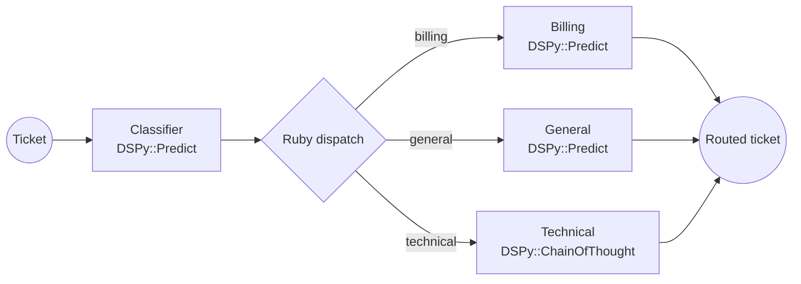

A single support prompt starts to creak when billing, product questions, and incidents need different context or different models. A classifier followed by specialized handlers keeps those paths explicit.

This design is a deterministic workflow. A model predicts the ticket category, but Ruby selects the handler. The model cannot invent a route, call an undeclared operation, or alter the fallback.

The complete implementation is in [`examples/workflow_router.rb`](https://github.com/vicentereig/dspy.rb/blob/main/examples/workflow_router.rb).


```mermaid
flowchart LR
    In((Ticket))
    Router["Classifier\nDSPy::Predict"]
    Branch{"Ruby dispatch"}
    Billing["Billing\nDSPy::Predict"]
    General["General\nDSPy::Predict"]
    Technical["Technical\nDSPy::ChainOfThought"]
    Out((Routed ticket))

    In --> Router --> Branch
    Branch -->|billing| Billing --> Out
    Branch -->|general| General --> Out
    Branch -->|technical| Technical --> Out
```

## Why start with a workflow?

Use a workflow when the branch set is known and the application must control which operations run. This router has three categories, one handler per category, and one output type. Those constraints make cost, fallback behavior, and traces easier to inspect.

An agent is useful when the model has a real reason to choose actions over several steps. You can later place a `DSPy::ReAct` agent behind one handler without turning the classifier or the surrounding router into an agent.

## Define the category

The classifier returns a `T::Enum`, so unknown category strings fail during output coercion instead of leaking into dispatch:

```ruby
class TicketCategory < T::Enum
  enums do
    General = new('general')
    Billing = new('billing')
    Technical = new('technical')
  end
end

class RouteSupportTicket < DSPy::Signature
  input { const :message, String }

  output do
    const :category, TicketCategory
    const :confidence, Float
    const :reason, String
  end
end
```

The enum constrains the classifier result at runtime. Ruby does not provide compile-time exhaustiveness for the handler hash, so the router still validates missing handlers explicitly.

## Give each handler the same result shape

Each playbook changes the task description while sharing its input and output fields:

```ruby
module SupportPlaybooks
  module SharedSchema
    def self.included(base)
      base.class_eval do
        input { const :message, String }

        output do
          const :resolution_summary, String
          const :recommended_steps, T::Array[String]
          const :tags, T::Array[String]
        end
      end
    end
  end

  class Billing < DSPy::Signature
    include SharedSchema
    description "Resolve billing or refund issues with policy-aware guidance."
  end

  class Technical < DSPy::Signature
    include SharedSchema
    description "Handle technical or outage reports with diagnostic steps."
  end
end
```

The signatures hold task and field descriptions. DSPy.rb turns them into provider-facing prompts and validates the returned fields. You maintain the program boundary rather than a separate prompt template for every route.

## Dispatch with ordinary Ruby

The router injects a classifier and a handler map, then selects exactly one handler:

```ruby
class SupportRouter < DSPy::Module
  def initialize(classifier:, handlers:, fallback_category: TicketCategory::General)
    super()
    @classifier = classifier
    @handlers = handlers
    @fallback_category = fallback_category
  end

  def forward(**input_values)
    classification = @classifier.call(**input_values)
    handler = @handlers.fetch(
      classification.category,
      @handlers[@fallback_category]
    )
    raise ArgumentError, "Missing handler for #{classification.category.serialize}" unless handler
    issue = handler.call(**input_values)

    RoutedTicket.new(
      category: classification.category,
      model_id: handler.lm&.model_id || DSPy.config.lm&.model_id,
      confidence: classification.confidence,
      reason: classification.reason,
      resolution_summary: issue.resolution_summary,
      recommended_steps: issue.recommended_steps,
      tags: issue.tags
    )
  end
end
```

The example configures billing and general handlers with Haiku and the technical handler with Sonnet. Model selection remains visible in the handler map and can be changed without altering the signature or call site.

## Trace the branch

Because `SupportRouter` is a `DSPy::Module`, its child predictor and LM spans share the module trace. The returned `RoutedTicket` also records the selected model. With observability configured, the trace answers three operational questions: what category the classifier chose, which handler ran, and which model produced the response.

Measurements recorded on November 16, 2025 showed the intended split:

- A general request stayed on Haiku and completed in 4.37 seconds.
- A technical request used Haiku for routing, then Sonnet for a 12.39-second handler call.
- A billing request stayed on Haiku and completed in 6.56 seconds.

These are three example traces, not performance guarantees. Use [`lf-cli`](https://github.com/vicentereig/lf-cli) or your OpenTelemetry backend to inspect your own distribution.

## Run it

```bash
echo "ANTHROPIC_API_KEY=sk-ant-..." >> .env
bundle install
bundle exec ruby examples/workflow_router.rb
```

Before shipping, evaluate the classifier against historical tickets and test every handler mapping. Replace the classifier with a heuristic when the categories can be decided without an LM. Promote a handler to a [ReAct agent](https://oss.vicente.services/dspy.rb/blog/articles/react-agent-tutorial/) only when that branch needs bounded tool selection over several steps.

The router stays a workflow either way. Ruby still owns the route.
