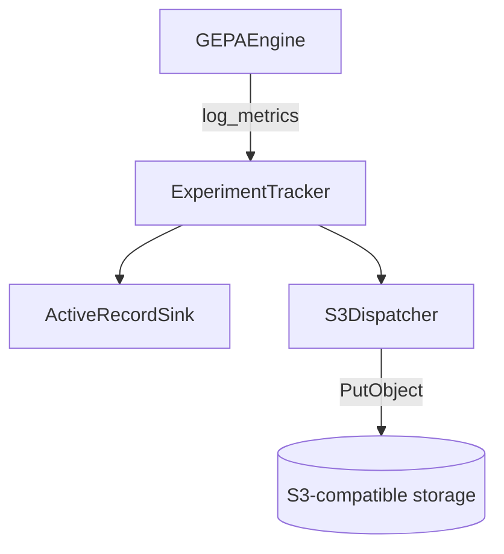
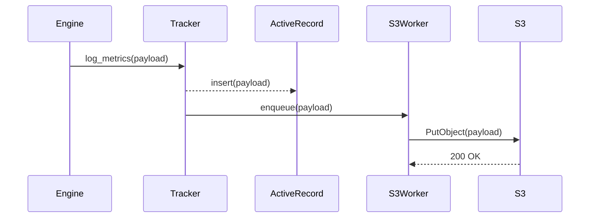

# GEPA Optimizer (Beta)

> Genetic-Pareto Reflective Prompt Evolution for DSPy.rb

GEPA evolves a module's instructions by replaying traces, collecting feedback, and asking a reflection
model to propose improvements. The Ruby port currently supports:

- Core GEPA engine (state, Pareto frontier, reflective proposer).
- DSPy teleprompter (`DSPy::Teleprompt::GEPA`) that works with any `DSPy::Module` built from a signature or composite module.
- Optional reflection LM via `DSPy::ReflectionLM` or any callable object (text only for now).
- Merge proposer (`GEPA::Proposer::MergeProposer`) for recombining high-scoring descendants.

```ruby
gepa = DSPy::Teleprompt::GEPA.new(
  metric: ->(example, prediction) { prediction[:answer] == example.expected_values[:answer] ? 1.0 : 0.0 },
  reflection_lm: DSPy::ReflectionLM.new('openai/gpt-4o-mini', api_key: ENV['OPENAI_API_KEY'])
)

result = gepa.compile(student_module, trainset: train_examples, valset: validation_examples)
```

**Reflection LM requirements**
- Plain-text responses (structured outputs disabled).
- Returns the updated instruction inside ``` fences (handled automatically by `InstructionProposalSignature`).
- Pass a callable (e.g. `reflection_lm.method(:call).to_proc`) when using custom stubs so Sorbet accepts the type.
- Prompts now include per-predictor traces, so reflection models see the component name and its diff instead of a single shared transcript.

## Predictor-level feedback

- Pass `feedback_map` when constructing the teleprompter to supply per-component feedback hooks:

```ruby
feedback_map = {
  'alpha' => lambda do |predictor_output:, predictor_inputs:, module_inputs:, module_outputs:, captured_trace:|
    DSPy::Prediction.new(
      score: predictor_output[:answer] == module_inputs.expected_values[:answer] ? 1.0 : 0.0,
      feedback: "alpha needs to mention #{module_inputs.expected_values[:answer]}"
    )
  end
}

gepa = DSPy::Teleprompt::GEPA.new(metric: metric, feedback_map: feedback_map)
```

- Each proc receives the component's output, its inputs, the full module example/prediction, and the captured trace so you can craft domain-specific guidance without rewriting the global metric.

## Testing

- `spec/integration/dspy/teleprompt/gepa_smoke_spec.rb` exercises the full reflective optimization loop with telemetry, experiment tracking, and a deterministic reflection LM.
- Snapshot expectations live in `spec/fixtures/gepa/smoke_snapshot.yml`, giving the integration spec a cassette-like regression target.
- Regenerate the snapshot with `bundle exec ruby -I lib examples/gepa_snapshot.rb` whenever fixture drift is intentional.
- For a full workflow, see `examples/ade_optimizer_gepa/`, which optimizes the ADE classifier using GEPA and `feedback_map` hooks.

## Experiment tracking

- `GEPA::Logging::ExperimentTracker` allows you to add subscribers that persist metrics. For example, wiring an ActiveRecord model:

```ruby
tracker = GEPA::Logging::ExperimentTracker.new

tracker.with_subscriber do |event|
  GepaExperiment.create!(
    run_id: event[:metrics][:run_id],
    step: event[:step],
    payload: event[:metrics]
  )
end

teleprompter = DSPy::Teleprompt::GEPA.new(metric: metric)
result = teleprompter.compile(program, trainset:, valset:)
```

## S3-compatible logging design

### Requirements
- Persist experiment logs to an S3-compatible bucket (MinIO, Cloudflare R2, AWS) without blocking the optimization loop.
- Offer a pluggable local sink (ActiveRecord or JSONL) for quick inspection while offline.
- Guarantee append-only writes and idempotent uploads so retries do not duplicate events.
- Defer network interaction to a background worker while keeping the tracker API synchronous.





## Parity roadmap

- Richer dataset adapters (multi-predictor, ReAct trace capture). Current Ruby adapter mirrors all named predictors but shares the same batch feedback across them until per-predictor traces land.
- Optional logging backends (e.g., Langfuse, WandB) layered on top of the experiment tracker subscribers.
- Parity checks against the Python GEPA test suite.
